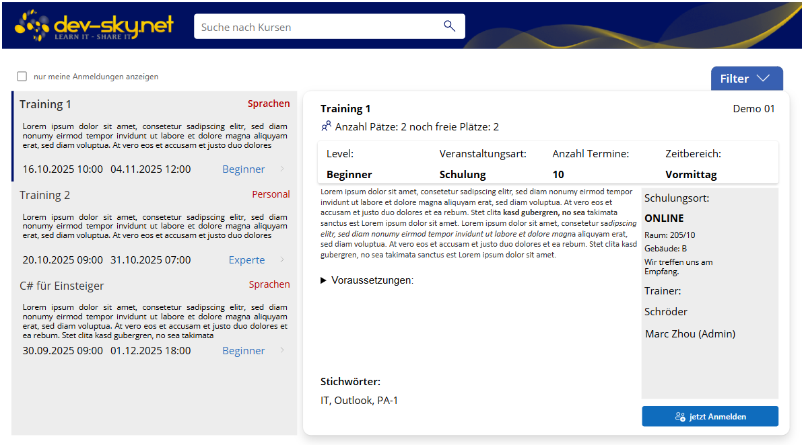
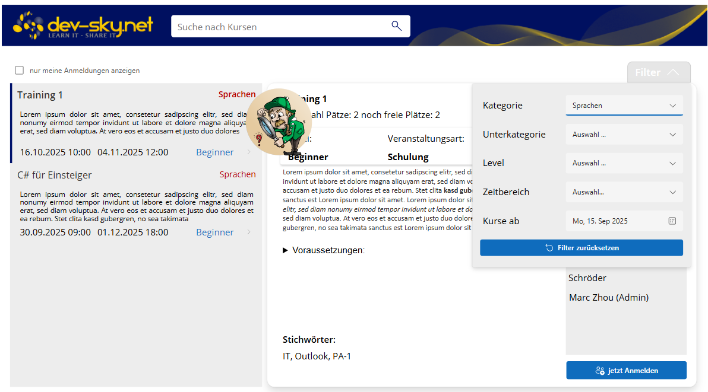
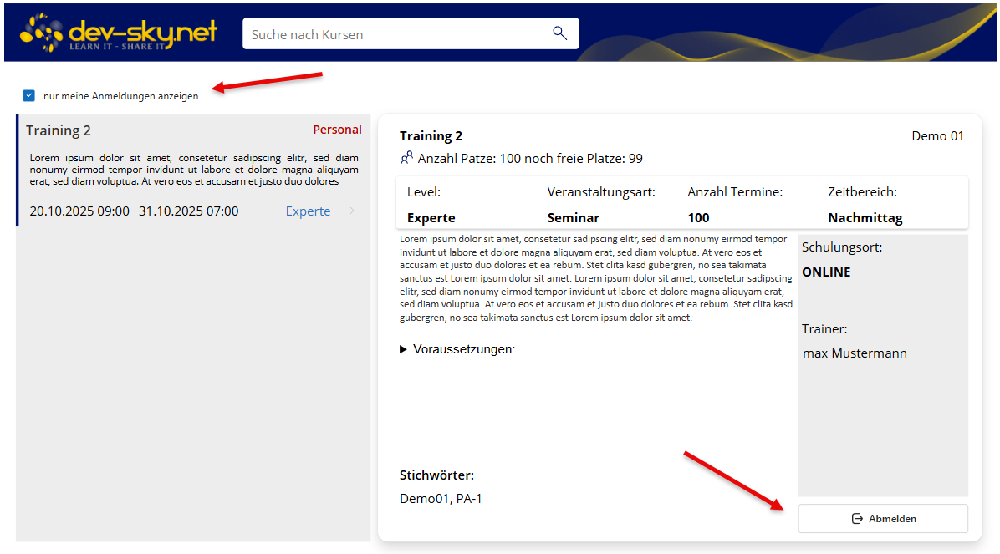
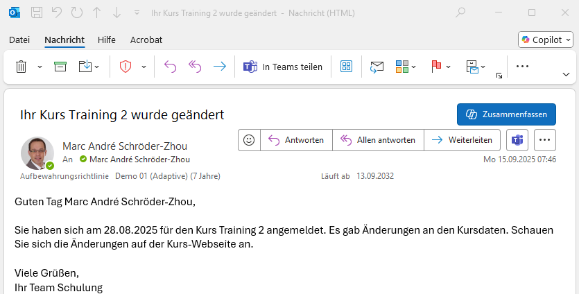
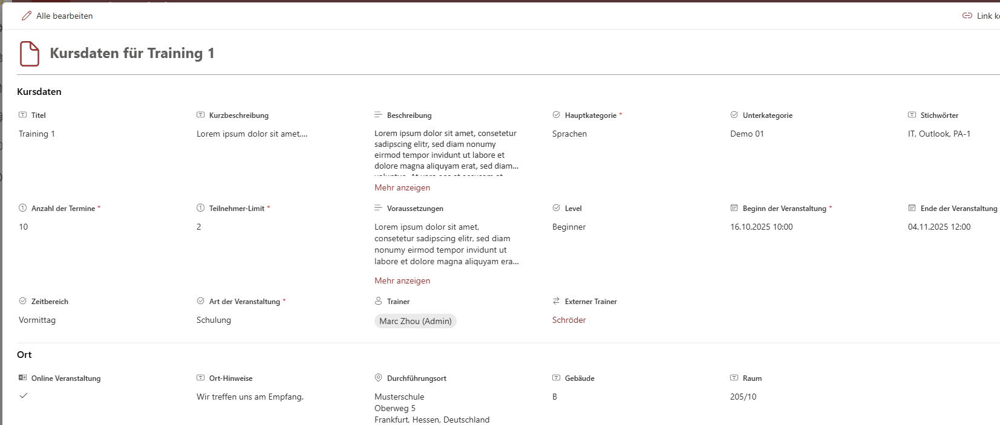

# Online Learning Course Manager

## Summary

Provides an Power Platform Canvas App to mange learning courses. Managed course offers, allows people to register to courses. The App managed the available seats, offers a course filter and includes an Power Automate Flow to notify participants about course changes. The App creates on demand an appointment entry in the user calendar.
 

*Start screen with no selected course*


*Selected course with all details*


*Filter for courses.*


*Show only courses for the current user.*



*E-Mail Notification about course changes*

## Applies to


## Compatibility

<!--
Update the compatibility below.

If a premium license is not required and there are no experimental features used in your solution:


If a premium license is required and there are experimental features used in your solution:


Don't worry if you're unsure about the compatibility matrix above. We'll verify it when we approve the PR. 
-->


## Contributors
<!--
We use this section to recognize and promote your contributions. Please provide one author per line -- even if you worked together on it.

We'll only use the info you provided here. Make sure to include your full name, not just your GitHub username.

Provide a link to your GitHub profile to help others find more cool things you have done. The only link we'll accept is a link to your GitHub profile.

If you want to provide links to your social media, blog, and employer name, make sure to update your GitHub profile.
-->

* Marc Andre Schröder-Zhou (https://github.com/maschroeder-z)

## Version history

Version|Date|Comments
-------|----|--------
1.0|September 15, 2025|Initial release

## Prerequisites
The Canvas App uses SharePoint Custom lists to store and manage all information. The solution uses enviroment variables to define the concrete URL addresses for the lists.
Following lists are needed:
* List with all Trainings
* List to save registered user
* List for external trainer data (used as lookup list)
Alle lists can be created with the JSON-file from the Lists directory with the PnP-command Add-PnPSiteScript. 

*List form for manage course data*

## Minimal path to awesome

<!-- 
PRO TIP:

For commands, use the `code syntax`

For button labels, page names, dialog names, etc. as they appear on the screen, use **Bold**

Don't use "click", use "select" or "use"

As tempting as it may be, don't just use images to describe the steps. Let's be as inclusive as possible and think about accessibility.

-->

### Using the solution zip

* [Download](./dist/Schulungsverwaltung_1_0_0_1.zip) the `.zip` from the `solution` folder
* Within **Power Apps Studio**, import the solution `.zip` file using **Solutions** > **Import Solution** and select the `.zip` file you just packed.
* During installation set the enviroment variables to your lists
* Open the app in edit mode and make sure the data source **Data source name** is connected correctly.

### Using the source code

You can also use the [Power Apps CLI](https://docs.microsoft.com/powerapps/developer/data-platform/powerapps-cli) to pack the source code by following these steps:

* Clone the repository to a local drive
* Pack the source files back into a solution `.zip` file:

  ```bash
  pac solution pack --zipfile pathtodestinationfile --folder pathtosourcefolder --processCanvasApps
  ```

  Making sure to replace `pathtosourcefolder` to point to the path to this sample's `sources` folder, and `pathtodestinationfile` to point to the path of this solution's `.zip` file (located under the `dist` folder)
* Within **Power Apps Studio**, import the solution `.zip` file using **Solutions** > **Import Solution** and select the `.zip` file you just packed.

## Features
This solution illustrates the following concepts on top of the Power Platform:
* Use always query delegation. Prevent loading of huge amount of data.
* Use advanced filtering.
* Use additional connector to create appointment entries in user calendar.
* Combined with an Power Automate Flow in one solution

## Video
[](https://youtu.be/eqonr-PNE6E)

## Help
Please contact me for further help or information about the sample.

## Disclaimer

**THIS CODE IS PROVIDED *AS IS* WITHOUT WARRANTY OF ANY KIND, EITHER EXPRESS OR IMPLIED, INCLUDING ANY IMPLIED WARRANTIES OF FITNESS FOR A PARTICULAR PURPOSE, MERCHANTABILITY, OR NON-INFRINGEMENT.**


